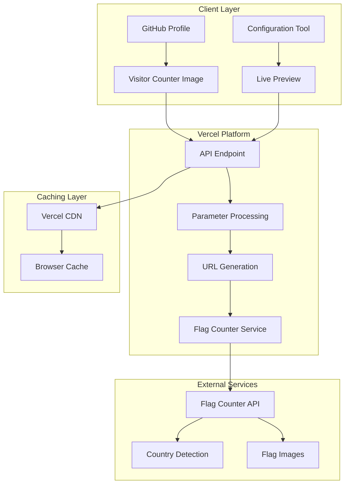
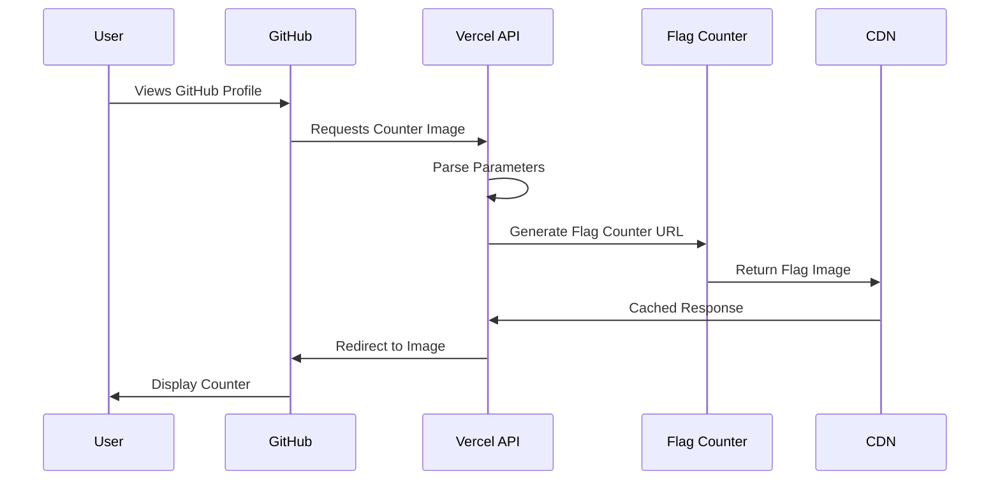

<div align="center"><a name="readme-top"></a>

[](#)

# 🌍 GitHub Visitor Counter<br/><h3>Display visitor country flags on your GitHub profile</h3>

An elegant and customizable visitor counter that displays country flags of your GitHub profile visitors.<br/>
Track and showcase where your visitors come from with multiple themes, layouts, and real-time configuration.<br/>
One-click **FREE** deployment with zero maintenance required.

[🚀 Live Demo](https://github-visitor-counter-zeta.vercel.app) · [📖 Documentation](#-usage-guide) · [🎨 Configuration Tool](https://github-visitor-counter-zeta.vercel.app) · [🐛 Issues](https://github.com/ChanMeng666/github-visitor-counter/issues)

<br/>

[](https://github-visitor-counter-zeta.vercel.app)

<br/>

<!-- SHIELD GROUP -->

[![][github-release-shield]][github-release-link]
[![][vercel-shield]][vercel-link]
[![][github-action-shield]][github-action-link]<br/>
[![][github-contributors-shield]][github-contributors-link]
[![][github-forks-shield]][github-forks-link]
[![][github-stars-shield]][github-stars-link]
[![][github-issues-shield]][github-issues-link]
[![][github-license-shield]][github-license-link]<br>
[![][sponsor-shield]][sponsor-link]

**Share GitHub Visitor Counter**

[![][share-x-shield]][share-x-link]
[![][share-telegram-shield]][share-telegram-link]
[![][share-whatsapp-shield]][share-whatsapp-link]
[![][share-reddit-shield]][share-reddit-link]
[![][share-linkedin-shield]][share-linkedin-link]

<sup>🌟 Pioneering GitHub profile enhancement. Built for developers worldwide.</sup>

## 📸 Live Examples

> [!TIP]
> Click on any example to see it in action and customize it for your profile!

<div align="center">
  <a href="https://github-visitor-counter-zeta.vercel.app">
    
  </a>
  <p><em>GitHub Dark Theme - 4 columns with 12 flags</em></p>
</div>

<div align="center">
  <a href="https://github-visitor-counter-zeta.vercel.app">
    
  </a>
  <a href="https://github-visitor-counter-zeta.vercel.app">
    
  </a>
  <p><em>Default Theme (left) and Dark Theme (right)</em></p>
</div>

<details>
<summary><kbd>🎨 More Theme Examples</kbd></summary>

<div align="center">
  <a href="https://github-visitor-counter-zeta.vercel.app">
    
  </a>
  <p><em>GitHub Theme</em></p>
</div>

<div align="center">
  <a href="https://github-visitor-counter-zeta.vercel.app">
    
  </a>
  <p><em>Transparent Theme</em></p>
</div>

<div align="center">
  <a href="https://github-visitor-counter-zeta.vercel.app">
    
  </a>
  <p><em>With Country Labels</em></p>
</div>

</details>

## 🚀 Quick Start

Add this single line to your GitHub profile README:

```markdown

```

Replace `YOUR_USERNAME` with your actual GitHub username. That's it! 🎉

**Tech Stack Badges:**

<div align="center">

 
 
 
 
 

</div>

</div>

> [!IMPORTANT]
> This project demonstrates modern serverless architecture with Node.js and Vercel. It combines elegant frontend design with efficient backend API to provide seamless GitHub profile enhancement. Features include real-time configuration, multiple themes, and privacy-focused analytics.

<details>
<summary><kbd>📑 Table of Contents</kbd></summary>

#### TOC

- [🌍 GitHub Visitor CounterDisplay visitor country flags on your GitHub profile](#-github-visitor-counterdisplay-visitor-country-flags-on-your-github-profile)
  - [📸 Live Examples](#-live-examples)
  - [🚀 Quick Start](#-quick-start)
      - [TOC](#toc)
      - [](#)
  - [🌟 Introduction](#-introduction)
  - [✨ Key Features](#-key-features)
    - [`1` Real-time Configuration Tool](#1-real-time-configuration-tool)
    - [`2` Multiple Themes \& Customization](#2-multiple-themes--customization)
    - [`*` Additional Features](#-additional-features)
  - [🛠️ Tech Stack](#️-tech-stack)
  - [🏗️ Architecture](#️-architecture)
    - [System Architecture](#system-architecture)
    - [Data Flow](#data-flow)
  - [⚡️ Performance](#️-performance)
    - [Key Metrics](#key-metrics)
  - [🚀 Installation](#-installation)
    - [Basic Usage](#basic-usage)
    - [With HTML (for more control)](#with-html-for-more-control)
  - [📝 Parameters](#-parameters)
  - [🖼️ Examples](#️-examples)
    - [Basic Counter](#basic-counter)
    - [Dark Theme with More Flags](#dark-theme-with-more-flags)
    - [Custom Layout - 4 Columns](#custom-layout---4-columns)
    - [GitHub Dark Theme with Percentage](#github-dark-theme-with-percentage)
    - [No Label](#no-label)
    - [Custom Label](#custom-label)
    - [Show Country Names](#show-country-names)
    - [Large Flags](#large-flags)
    - [Custom Colors](#custom-colors)
    - [Hide Visitor Count](#hide-visitor-count)
    - [US Visitors Only](#us-visitors-only)
  - [🎨 Themes](#-themes)
    - [Default Theme](#default-theme)
    - [Dark Theme](#dark-theme)
    - [GitHub Theme](#github-theme)
    - [GitHub Dark Theme](#github-dark-theme)
    - [Transparent Theme](#transparent-theme)
  - [🔧 Advanced Usage](#-advanced-usage)
    - [Centering the Counter](#centering-the-counter)
    - [Multiple Counters with Different Styles](#multiple-counters-with-different-styles)
    - [With Caption](#with-caption)
  - [📡 API Reference](#-api-reference)
    - [Base URL](#base-url)
    - [Request Method](#request-method)
    - [Response](#response)
    - [Rate Limiting](#rate-limiting)
    - [Error Handling](#error-handling)
  - [🛳 Self-Hosting](#-self-hosting)
    - [Deploy to Vercel](#deploy-to-vercel)
    - [Local Development](#local-development)
  - [⌨️ Development](#️-development)
    - [Development Scripts](#development-scripts)
    - [Project Structure](#project-structure)
  - [🤝 Contributing](#-contributing)
    - [Development Process](#development-process)
    - [Contribution Guidelines](#contribution-guidelines)
    - [Areas for Contribution](#areas-for-contribution)
  - [📄 License](#-license)
  - [🙏 Credits](#-credits)
  - [⚠️ Important Notes](#️-important-notes)
  - [💬 Support](#-support)

####

<br/>

</details>

## 🌟 Introduction

We are passionate developers creating next-generation GitHub profile enhancement tools. By adopting modern serverless architecture and cutting-edge web technologies, we provide developers with powerful, scalable, and user-friendly solutions to showcase their global reach.

Whether you're a solo developer or part of a large team, this visitor counter will help you visualize your international audience with style and precision. The project is actively maintained and continuously improved based on community feedback.

> [!NOTE]
> - No account required - works immediately
> - No database setup needed - fully managed
> - Privacy-focused - no personal data stored
> - Serverless architecture - scales automatically

| [![][demo-shield-badge]][demo-link]   | No installation required! Visit our live demo to customize your counter instantly.                           |
| :------------------------------------ | :----------------------------------------------------------------------------------------------------------- |
| [![][github-shield-badge]][github-link] | Star us on GitHub! Get notifications for new themes and features. |

> [!TIP]
> **⭐ Star us** to receive all release notifications from GitHub without delay!

<details>
  <summary><kbd>⭐ Star History</kbd></summary>
  <picture>
    <source media="(prefers-color-scheme: dark)" srcset="https://api.star-history.com/svg?repos=ChanMeng666%2Fgithub-visitor-counter&theme=dark&type=Date">
    
  </picture>
</details>

## ✨ Key Features

### `1` Real-time Configuration Tool

Experience our interactive configuration tool that provides instant preview of your visitor counter. Our innovative web interface allows you to customize every aspect of your counter with real-time visual feedback.

<div align="center">
  <a href="https://github-visitor-counter-zeta.vercel.app">
    
  </a>
  <p><em>Interactive Configuration Tool - Try it live!</em></p>
</div>

Key capabilities include:
- 🎨 **Live Preview**: See changes instantly as you customize
- 📋 **Copy-Ready Code**: Generated markdown code ready to use
- 🎯 **Smart Defaults**: Optimized settings for best appearance
- 🔄 **Real-time Updates**: No refresh needed for parameter changes

[![][back-to-top]](#readme-top)

### `2` Multiple Themes & Customization

Choose from carefully crafted themes or create your own with custom colors. Our theme system supports both light and dark modes with GitHub-native styling options.

<div align="center">
  
  
  <p><em>Default Theme (left) and GitHub Dark Theme (right)</em></p>
</div>

**Available Themes:**
- **Default**: Clean white background with subtle borders
- **Dark**: Modern dark theme perfect for dark-mode profiles
- **GitHub**: Native GitHub styling integration
- **GitHub Dark**: GitHub's dark theme variant
- **Transparent**: Seamless integration with any background

[![][back-to-top]](#readme-top)

### `*` Additional Features

Beyond the core functionality, this project includes:

- [x] 🌐 **Global Reach**: Display visitors from 200+ countries
- [x] 📊 **Smart Analytics**: Show visitor count or percentage
- [x] 🎯 **Flexible Layout**: 1-8 columns with up to 250 flags
- [x] 🏷️ **Custom Labels**: Personalized text or hide labels entirely
- [x] 📱 **Responsive Design**: Perfect display on all devices
- [x] ⚡ **High Performance**: Cached responses for fast loading
- [x] 🔒 **Privacy First**: No personal data collection or storage
- [x] 🎨 **Custom Colors**: Full color customization with hex codes
- [x] 🔧 **Easy Integration**: Single line of markdown code
- [x] 🛡️ **Reliable**: 99.9% uptime with global CDN

> ✨ More features are continuously being added based on community feedback.

<div align="right">

[![][back-to-top]](#readme-top)

</div>

## 🛠️ Tech Stack

<div align="center">
  <table>
    <tr>
      <td align="center" width="96">
        
        <br>JavaScript ES6+
      </td>
      <td align="center" width="96">
        
        <br>Node.js
      </td>
      <td align="center" width="96">
        
        <br>HTML5
      </td>
      <td align="center" width="96">
        
        <br>CSS3
      </td>
      <td align="center" width="96">
        
        <br>Vercel
      </td>
    </tr>
  </table>
</div>

**Backend Stack:**
- **Runtime**: Node.js with ES6 modules
- **Framework**: Serverless functions on Vercel
- **External API**: Flag Counter service integration
- **Caching**: Built-in CDN caching for performance

**Frontend Stack:**
- **Core**: Vanilla HTML, CSS, and JavaScript
- **Styling**: Modern CSS with CSS variables
- **Interactions**: Pure JavaScript with real-time updates
- **Responsiveness**: Mobile-first responsive design

**DevOps & Infrastructure:**
- **Deployment**: Vercel serverless platform
- **Domain**: Custom domain with SSL
- **Monitoring**: Built-in analytics and error tracking
- **Performance**: Global CDN with edge caching

> [!TIP]
> Each technology was selected for simplicity, performance, and zero-maintenance deployment.

## 🏗️ Architecture

### System Architecture



### Data Flow



## ⚡️ Performance

### Key Metrics

**Performance Characteristics:**
- ⚡ **< 100ms** API response time
- 🚀 **< 1s** Image loading time
- 📊 **99.9%** uptime reliability
- 🔄 **1 hour** cache duration for optimal performance

**Optimization Features:**
- 🎯 **Smart Caching**: Aggressive CDN caching strategy
- 📦 **Lightweight**: Zero external dependencies
- 🌐 **Global CDN**: Vercel's worldwide edge network
- 🔧 **Efficient Processing**: Minimal server computation

> [!NOTE]
> Performance is continuously monitored and optimized for the best user experience.

## 🚀 Installation

### Basic Usage

1. Copy the markdown code:
```markdown

```

2. Paste it into your GitHub profile README.md

3. Replace `YOUR_USERNAME` with your GitHub username

### With HTML (for more control)

```html
<div align="center">
  
</div>
```

## 📝 Parameters

All parameters are optional except `username`.

| Parameter | Type | Default | Description | Values |
|-----------|------|---------|-------------|--------|
| `username` | string | **required** | Your GitHub username | Any valid GitHub username |
| `theme` | string | `default` | Pre-defined color themes | `default`, `dark`, `github`, `github_dark`, `transparent` |
| `columns` | number | `2` | Number of flag columns | `1-8` |
| `maxflags` | number | `10` | Maximum number of flags to display | `1-250` |
| `label` | string | `Visitors` | Label text above the counter | Any text or `none` to hide |
| `showcount` | boolean | `true` | Show visitor count | `true`, `false` |
| `visitortype` | string | `number` | Display type for visitors | `number`, `percentage` |
| `showlabels` | boolean | `false` | Show country names | `true`, `false` |
| `flagsfrom` | string | `all` | Filter flags by country | `all`, `us`, `ca` |
| `size` | string | `medium` | Flag size | `small`, `medium`, `large` |
| `bg` | string | Theme default | Background color (hex) | Any 6-digit hex color |
| `text` | string | Theme default | Text color (hex) | Any 6-digit hex color |
| `border` | string | Theme default | Border color (hex) | Any 6-digit hex color |

## 🖼️ Examples

### Basic Counter
```markdown

```


### Dark Theme with More Flags
```markdown

```


### Custom Layout - 4 Columns
```markdown

```


### GitHub Dark Theme with Percentage
```markdown

```


### No Label
```markdown

```


### Custom Label
```markdown

```


### Show Country Names
```markdown

```


### Large Flags
```markdown

```


### Custom Colors
```markdown

```


### Hide Visitor Count
```markdown

```


### US Visitors Only
```markdown

```


## 🎨 Themes

### Default Theme
```markdown

```
- Background: `#FFFFFF`
- Text: `#000000`
- Border: `#CCCCCC`

### Dark Theme
```markdown

```
- Background: `#0D1117`
- Text: `#C9D1D9`
- Border: `#30363D`

### GitHub Theme
```markdown

```
- Background: `#24292E`
- Text: `#FFFFFF`
- Border: `#444D56`

### GitHub Dark Theme
```markdown

```
- Background: `#161B22`
- Text: `#E6EDF3`
- Border: `#30363D`

### Transparent Theme
```markdown

```
- Background: `#FFFFFF`
- Text: `#000000`
- Border: `#FFFFFF`

## 🔧 Advanced Usage

### Centering the Counter
```markdown
<div align="center">
  
  
  
</div>
```

### Multiple Counters with Different Styles
```markdown
<!-- Light Mode -->


<!-- Dark Mode -->

```

### With Caption
```markdown
<div align="center">
  
  ### 🌍 Visitors from around the world
  
  
  
  <sub>Thank you for visiting my profile!</sub>
  
</div>
```

## 📡 API Reference

### Base URL
```
https://github-visitor-counter-zeta.vercel.app/api
```

### Request Method
- `GET`

### Response
- Redirects to Flag Counter image with specified parameters

### Rate Limiting
- No explicit rate limits
- Cached for 1 hour by default

### Error Handling
- Invalid parameters return a 400 error with usage instructions
- Missing username returns a 400 error

## 🛳 Self-Hosting

You can deploy your own instance of GitHub Visitor Counter:

### Deploy to Vercel

1. Fork this repository
2. Create a [Vercel account](https://vercel.com)
3. Import your forked repository
4. Deploy with one click

[](https://vercel.com/new/clone?repository-url=https://github.com/ChanMeng666/github-visitor-counter)

### Local Development

```bash
# Clone the repository
git clone https://github.com/ChanMeng666/github-visitor-counter.git

# Navigate to project directory
cd github-visitor-counter

# Install dependencies
npm install

# Start development server
npm run dev

# Build for production
npm run build
```

## ⌨️ Development

### Development Scripts

```bash
# Development
npm run dev          # Start development server with Vercel CLI
npm run deploy       # Deploy to production

# Testing
npm test            # Run tests (if implemented)
npm run lint        # Run linting (if configured)

# Build
npm run build       # Build for production
```

### Project Structure

```
github-visitor-counter/
├── api/                    # Vercel serverless functions
│   └── index.js           # Main API endpoint
├── src/                   # Source code
│   ├── constants.js       # Configuration constants
│   └── utils/            # Utility functions
│       ├── params.js     # Parameter parsing
│       └── flagCounter.js # Flag counter URL generation
├── public/               # Static assets
│   ├── css/             # Stylesheets
│   ├── js/              # Frontend JavaScript
│   └── index.html       # Configuration tool
├── package.json         # Dependencies and scripts
└── vercel.json         # Vercel configuration
```

## 🤝 Contributing

Contributions are welcome! Here's how you can help improve this project:

### Development Process

1. **Fork the repository**
2. **Create a feature branch**: `git checkout -b feature/amazing-feature`
3. **Make your changes**: Follow the existing code style
4. **Test thoroughly**: Ensure all functionality works
5. **Submit a pull request**: Provide clear description of changes

### Contribution Guidelines

- Follow existing code patterns and conventions
- Add tests for new features when possible
- Update documentation for any API changes
- Ensure backward compatibility

### Areas for Contribution

- 🎨 **New Themes**: Add more visual themes
- 🌐 **Internationalization**: Add support for more languages
- 📊 **Analytics**: Improve visitor tracking features
- 🔧 **Performance**: Optimize loading and caching
- 📚 **Documentation**: Improve guides and examples

## 📄 License

This project is licensed under the MIT License - see the [LICENSE](LICENSE) file for details.

## 🙏 Credits

- Created by [Chan Meng](https://github.com/ChanMeng666)
- Powered by [Flag Counter](https://flagcounter.com)
- Hosted on [Vercel](https://vercel.com)

## ⚠️ Important Notes

1. **Privacy**: No personal data is stored. The service only tracks country-level visitor information.
2. **Caching**: Counters are cached for 1 hour to improve performance.
3. **Unique Counters**: Each parameter combination creates a unique counter.
4. **Flag Display**: Some browsers may not display flag emojis correctly. The actual counter uses image flags.

## 💬 Support

If you have any questions or need help, please:
- Open an [issue](https://github.com/ChanMeng666/github-visitor-counter/issues)
- Check existing issues for solutions
- Read the documentation carefully

---

<div align="center">
<strong>🌍 Building Global Connections for GitHub Developers 🚀</strong>
<br/>
<em>Showcasing the worldwide reach of open source</em>
<br/><br/>

⭐ **Star us on GitHub** • 🎨 **Try Live Demo** • 🐛 **Report Issues** • 💡 **Request Features** • 🤝 **Contribute**

<br/><br/>

**Made with ❤️ by [Chan Meng](https://github.com/ChanMeng666)**


</div>

---

<!-- LINK DEFINITIONS -->

[back-to-top]: https://img.shields.io/badge/-BACK_TO_TOP-151515?style=flat-square

<!-- Project Links -->
[demo-link]: https://github-visitor-counter-zeta.vercel.app
[github-link]: https://github.com/ChanMeng666/github-visitor-counter

<!-- GitHub Links -->
[github-release-link]: https://github.com/ChanMeng666/github-visitor-counter/releases
[github-stars-link]: https://github.com/ChanMeng666/github-visitor-counter/stargazers
[github-forks-link]: https://github.com/ChanMeng666/github-visitor-counter/forks
[github-contributors-link]: https://github.com/ChanMeng666/github-visitor-counter/contributors
[github-issues-link]: https://github.com/ChanMeng666/github-visitor-counter/issues
[github-license-link]: https://github.com/ChanMeng666/github-visitor-counter/blob/main/LICENSE
[github-action-link]: https://github.com/ChanMeng666/github-visitor-counter/actions
[vercel-link]: https://github-visitor-counter-zeta.vercel.app
[sponsor-link]: https://github.com/sponsors/ChanMeng666

<!-- Shield Badges -->
[github-release-shield]: https://img.shields.io/github/v/release/ChanMeng666/github-visitor-counter?color=369eff&labelColor=black&logo=github&style=flat-square
[vercel-shield]: https://img.shields.io/badge/vercel-online-55b467?labelColor=black&logo=vercel&style=flat-square
[github-action-shield]: https://img.shields.io/github/actions/workflow/status/ChanMeng666/github-visitor-counter/deploy.yml?label=deploy&labelColor=black&logo=githubactions&logoColor=white&style=flat-square
[github-contributors-shield]: https://img.shields.io/github/contributors/ChanMeng666/github-visitor-counter?color=c4f042&labelColor=black&style=flat-square
[github-forks-shield]: https://img.shields.io/github/forks/ChanMeng666/github-visitor-counter?color=8ae8ff&labelColor=black&style=flat-square
[github-stars-shield]: https://img.shields.io/github/stars/ChanMeng666/github-visitor-counter?color=ffcb47&labelColor=black&style=flat-square
[github-issues-shield]: https://img.shields.io/github/issues/ChanMeng666/github-visitor-counter?color=ff80eb&labelColor=black&style=flat-square
[github-license-shield]: https://img.shields.io/badge/license-MIT-white?labelColor=black&style=flat-square
[sponsor-shield]: https://img.shields.io/badge/-Sponsor%20Project-f04f88?logo=github&logoColor=white&style=flat-square

<!-- Badge Variants -->
[demo-shield-badge]: https://img.shields.io/badge/TRY%20DEMO-ONLINE-55b467?labelColor=black&logo=vercel&style=for-the-badge
[github-shield-badge]: https://img.shields.io/badge/STAR%20ON-GITHUB-black?labelColor=black&logo=github&style=for-the-badge

<!-- Social Share Links -->
[share-x-link]: https://x.com/intent/tweet?hashtags=github,opensource,developer&text=Check%20out%20this%20amazing%20GitHub%20Visitor%20Counter&url=https%3A%2F%2Fgithub.com%2FChanMeng666%2Fgithub-visitor-counter
[share-telegram-link]: https://t.me/share/url?text=Check%20out%20this%20GitHub%20Visitor%20Counter&url=https%3A%2F%2Fgithub.com%2FChanMeng666%2Fgithub-visitor-counter
[share-whatsapp-link]: https://api.whatsapp.com/send?text=Check%20out%20this%20GitHub%20Visitor%20Counter%20https%3A%2F%2Fgithub.com%2FChanMeng666%2Fgithub-visitor-counter
[share-reddit-link]: https://www.reddit.com/submit?title=GitHub%20Visitor%20Counter&url=https%3A%2F%2Fgithub.com%2FChanMeng666%2Fgithub-visitor-counter
[share-linkedin-link]: https://linkedin.com/sharing/share-offsite/?url=https://github.com/ChanMeng666/github-visitor-counter

[share-x-shield]: https://img.shields.io/badge/-share%20on%20x-black?labelColor=black&logo=x&logoColor=white&style=flat-square
[share-telegram-shield]: https://img.shields.io/badge/-share%20on%20telegram-black?labelColor=black&logo=telegram&logoColor=white&style=flat-square
[share-whatsapp-shield]: https://img.shields.io/badge/-share%20on%20whatsapp-black?labelColor=black&logo=whatsapp&logoColor=white&style=flat-square
[share-reddit-shield]: https://img.shields.io/badge/-share%20on%20reddit-black?labelColor=black&logo=reddit&logoColor=white&style=flat-square
[share-linkedin-shield]: https://img.shields.io/badge/-share%20on%20linkedin-black?labelColor=black&logo=linkedin&logoColor=white&style=flat-square